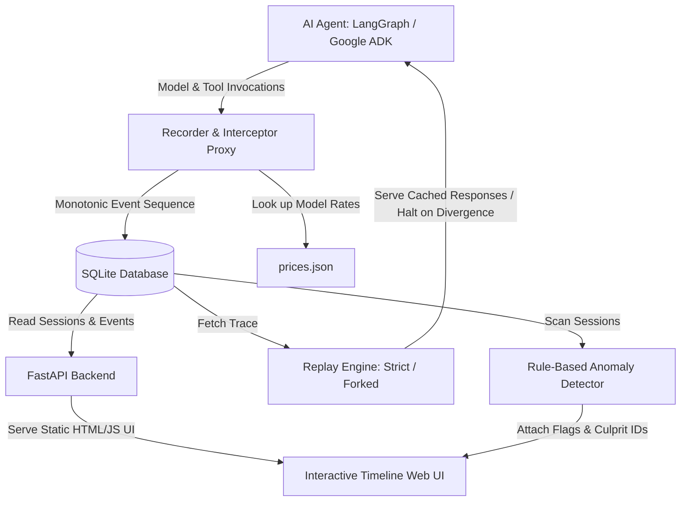

# ⚡ agent-replay

> **A logging proxy, observability timeline, and deterministic replay engine for AI agent tool and model calls.**

Developed as the practical implementation of **Project Proposal (24CS061)**.

---

## 🎯 The Problem

When conventional software fails, developers can attach debuggers, inspect stack traces, and step through execution lines. But in autonomous AI agents, the execution path is generated at runtime by stochastic LLMs and disappears after the request finishes. 

When an agent loops on a tool, quiet-fails after a malformed payload, or hallucinates an unexpected parameter, reproducing the issue is notoriously unreliable. Re-running the agent incurs network delays and API billing, and often takes an entirely different path.

`agent-replay` solves this gap:
1. **Records** every tool call and model call with timestamps, parameters, return values, token usage, and calculated cost.
2. **Reconstructs** sessions as an interactive, chronologically ordered visual timeline.
3. **Replays** past sessions **stochastically-free and with $0 API cost** by serving stored responses from SQLite.
4. **Forks** executions by substituting a recorded response at step $k$, allowing developers to observe how downstream model calls adapt to modified states.
5. **Detects** statistical irregularities (loops, cost spikes, runaway durations) with transparent, explainable rule-based detectors.

---

## 🏗️ Architecture



---

## 📊 Core Data Schema

All interactions are captured in SQLite under the `events` table:

| Field | Type | Description |
| :--- | :--- | :--- |
| `session_id` | TEXT | Unique identifier grouping session events |
| `seq` | INTEGER | Monotonically increasing execution counter (1, 2, 3...) |
| `type` | TEXT | Event classification: `'tool_call'` or `'model_call'` |
| `name` | TEXT | Identifier (e.g. `search_docs`, `gemini-1.5-flash`) |
| `args_json` | TEXT | Full JSON serialized inputs / prompts |
| `result_json` | TEXT | Full JSON serialized outputs (NULL on failure) |
| `error` | TEXT | Traceback / error message if call failed |
| `started_at` | TEXT | UTC ISO-8601 timestamp |
| `duration_ms` | REAL | High-precision execution duration in milliseconds |
| `tokens_in` | INTEGER | Input / prompt token count |
| `tokens_out` | INTEGER | Output / candidate token count |
| `cost_usd` | REAL | Calculated cost derived from `prices.json` |

---

## 🚀 Quickstart

### 1. Prerequisites
- Python 3.11+ (Python 3.12 recommended)
- Git

### 2. Environment Setup
Clone the repository and activate the virtual environment:
```powershell
cd D:\agent-replay
.\.venv\Scripts\Activate.ps1
pip install -r requirements.txt
```

Set up your Gemini API Key in `.env`:
```env
GEMINI_API_KEY=AIzaSy...
DEFAULT_MODEL=gemini-1.5-flash
```

Configure or customize token prices in `prices.json`:
```json
{
  "models": {
    "gemini-1.5-flash": {
      "input_cost_per_million": 0.075,
      "output_cost_per_million": 0.30
    }
  }
}
```

---

## 🎬 Running the Failure Scenarios & Replay Demos

### Scenario 1: Tool Looping & Rule-Based Detection
Run an agent stuck in a loop querying documentation with identical arguments:
```powershell
python scenarios/scenario_1_loop.py
```
**Outcome**:
- The session is recorded into SQLite.
- The `RepeatedToolCallsRule` flags the session with severity **DANGER**.
- Sequence IDs of the culprit loop steps are tagged and highlighted in the UI.

### Scenario 2: Strict Replay & Forked Substitution Recovery
Run an end-to-end failure, strict reproduction, and recovery test:
```powershell
python scenarios/scenario_2_malformed_response.py
```
**Outcome**:
1. **Live Failure**: The database tool fails with a simulated timeout error.
2. **Strict Replay**: Re-runs the exact agent workflow deterministically with **zero live API or database calls ($0 cost)**.
3. **Forked Replay**: Substitutes the failed response at sequence #1 with valid account data (`{"status": "ok", "balance": 500.0}`). Downstream model and tool calls resume live and successfully complete!

---

## 🌐 Interactive Timeline Web UI

Launch the FastAPI observability dashboard:
```powershell
uvicorn agent_replay.api:app --reload --host 127.0.0.1 --port 8000
```
Open your browser to: **[http://127.0.0.1:8000](http://127.0.0.1:8000)**

### Features:
- **Session Explorer**: Browse past sessions with start time, duration, and total USD cost.
- **Metric Cards**: Aggregate tokens, costs, durations, and tool vs model call ratios.
- **Flagged Badges**: Warning and Danger alert banners for anomaly sessions.
- **Chronological Timeline**: Step-by-step visual cards with duration badges, cost pills, and collapsible JSON payloads for both inputs and outputs.
- **Culprit Highlighting**: Cards identified by anomaly rules glow with red borders and `[FLAGGED]` pills.

---

## 🧪 Running Automated Tests

Run the full unit and integration test suite:
```powershell
$env:PYTHONPATH = "src"
pytest -v
```

Run code formatting and linting:
```powershell
ruff check .
ruff format --check .
```